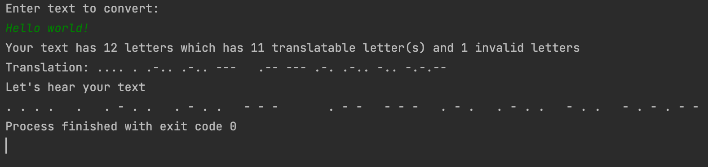

# Text 2 Morse Code

<!-- TABLE OF CONTENTS -->

  
Table of Contents

  <ol>
    <li>
      <a href="#about-the-project">About the Project</a>
    </li>
    <li><a href="#features">Futures</a></li>
    <li><a href="#usage">Usage</a></li>
    <li><a href="#license">License</a></li>
    <li><a href="#acknowledgments">Acknowledgments</a></li>
  </ol>

<!-- ABOUT THE PROJECT -->
## About the Project
A funny little side project to translate text into morse code. The program can convert
alphabets, numbers, and a few symbols in to morse code. As a final result the converted morse 
code text will be shown on the console and a sound illustration will be played for each text.

**Repository:** [Text2MorseCode](https://github.com/drliptons/text-to-morse-code)

(<a href="#top">back to top</a>)

<!-- FEATURES -->
## Features
___
* User input through console
* Convert alphabets (a - z), numbers (0 - 9), and symbols (. , ? ! - / @ ( )) into morse code
* Play a sound for each converted text

(<a href="#top">back to top</a>)

<!-- USAGE -->
## Usage
___
This project is for education and demonstration purposes. Anyone who is interested in this code is free to use it without any
prior permission.

(<a href="#top">back to top</a>)

<!-- LICENSE -->
## License
___
Distributed under the MIT License. Please see `LICENSE.md`
for further information

(<a href="#top">back to top</a>)

<!-- ACKNOWLEDGMENTS -->
## Acknowledgments
___
The sound effect in this project is from [SoundJay.com](https://www.soundjay.com). This person has created a huge library of sound effects
and they are free to use. You are awesome, Sound Jay!

(<a href="#top">back to top</a>)
